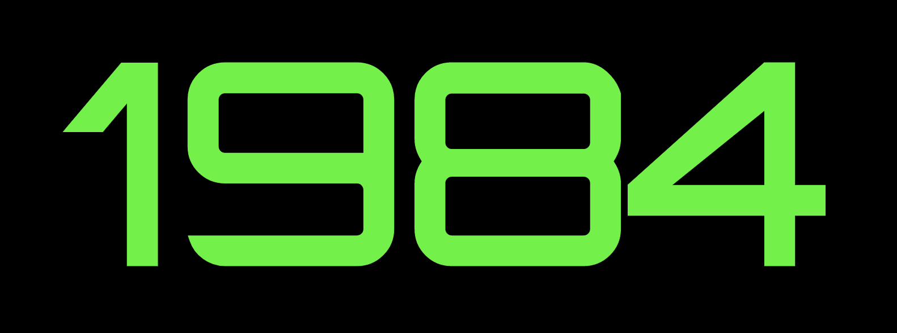

# 1984



>## Contents

- [Introduction](#Introduction)
- [Installation](#Installation)
- [Requirement](#Requirement)
- [Features](#Features)
- [Usage](#Usage)
- [Tech](#Usage)
- [Challenges](#Challenges)
- [Things to do](#Things-to-do)
- [Version Control](#Version-Control)
- [Other tools](#Other-tools)

>### Introduction

1945 게임을 모티브로한 게임 웹 어플리케이션. Mobile device를 laptop이나 desktop의 웹상의 화면과 연동해서 게임조작 가능.


>### Installation

#### - Client

```
git clone https://github.com/MrKamake/1984-client.git
cd 1984-client
yarn install
yarn start
```

#### - Server

```
git clone https://github.com/MrKamake/1984-server.git
cd 1984-server
yarn install
yarn start
```

>### Requirement

- Set server url in client

```js
src / constants / constant;
export const SERVER_API = isMobileDvice
  ? 'http://<"Input your network domain..">:4000'
  : 'http://localhost:4000';

export const SERVER_URL = isMobileDvice
  ? 'http://<"Input your network domain..">:5000'
  : 'http://localhost:5000';
```

- Set server envirionment

```
.env
DATA_BASE_URL="Input your MongoDB cluster url.."
SECRET_KEY="Input your secret key.."
SECRET_SESSION="Input your secret session.."
ONE_HOUR=3600000
WEB_CLIENT_DOMAIN=http://localhost:3000
MOBILE_CLIENT_DOMAIN="http://<"Input your network domain..">:3000"
```

>### Features
- Lopcal Passport와 bcrypt라이브러리를 사용해 회원정보 암호화
- Socket.io를 사용해 Play screen과 Control screen의 연동과 데이터 교환을 이용해 게임 진행(게임 시작, 비행기 조종, 게임 종료, 스코어 확인, 랭킹 확인, 재시작) 가능
- DOM 대신에 Canvas를 통해 게임 캐릭터들을 표현해서 자연스러운 움직임 표현

>### Usage

1. Laptop or Desktop에서 크롬브라우저(Play screen)에서 주소창에 `ttp://localhost:3000/`를 입력.
   Mobile Device는 Iphone의 Ssfari Browser(Control screen)에서만 지원하므로 브라우저 주소창에 `http://<YOUR_LOCAL_HOST_DOMAIN>:3000/`를 입력.
2. Play screen에서 Sign up으로 사용자 정보 생성.
3. 순서에 상관없이 Sign in.
4. Play screen or Control screen 에서 Start button 클릭.
5. Play screen으로 게임 화면을 보면서 Control screen의 Left, Right button으로 Airplane을 조작.
6. Game over Play screen에서 Score 확인 가능.
7. Control screen으로 Ranking, Restart button을 클릭해서 Play Screen으로 Ranking 확인 가능, 새로 시작 가능.

>### Tech

- Javascript (ES2015+)
- React, for component based architecture
- Routing using react-router
- State management using redux
- Node.js
- Express
- Mongo DB
- Mongoose, object data modeling library for Mongo DB
- Socket.IO
- Sass, for easy to understand stylesheet

>### Challenges

- **Socket.IO 활용의 어려움**

  : Play screen과 Control screen을 연결해서 사용하려면 다른 사용자와 socket이 연결되면 안된다. 그래서 고유한 값을 이용해서 socket에서 연결시켜줘야 한다. jasonwebtoken을 활용했다. 사용자가 회원가입을 하면서 입력하게 되는 이메일과 닉네임으로 암호화를 시켜서 해결했다.

- **Game에서 obstacle들이 랜덤한 위치에서 반복적으로 하강해야하는 상황에서의 어려움**

  : obstacle의 갯수만큼 돔을 모두 생성해서 하나씩 rerender하면서 위치값을 변경했다. 모든 obstacle이 이동하는 잦은 랜더링으로 인해 게임의 속도가 현저히 느려졌다.
  해결책을 찾던 중 Canvas를 찾았다. 처음 사용하는 Canvas에 적응이 쉽지 않았다. Canvas로 표현할 내용물들은 돔을 직접 생성하는 것이 아니라 하나의 Canvas 내에서 **그려지는 것**이므로 훨씬 메모리비용이 절감되고 랜더링이 줄어드므로 속도 또한 빨라진다.

- **Canvas API를 활용한 2D Graphics**

  : 게임에서 DOM을 컨트롤한다면 React기반에서 DOM의 상태를 빠르게 바꾸므로 리렌더가 된다. 렌더가 잦아지면서 화면은 버벅거리기 일쑤다. 그래서 Canvas API를 활용해서 Canvas에 해당하는 DOM에만 변경이 있기 때문에 그림을 그리듯이 자연스러운 표현 가능했다.

- **Canvas의 화질 관리의 어려움**

  : css를 이용해서 Canvas의 pixel 제어를 통해 화질 관리도 어려웠다.'이미지의 크기를 늘일 수록 화질은 떨어지고 줄일수록 화질은 좋아진다.'라는 개념을 적용했다. Canvas의 크기를 늘이고 감싸는 돔을 작게 줄이고 꽉 채우도록 했다.

>### Things to do

- **Socket의 활용도 증가**

  : 현재는 게임내에서 Restart기능을 사용하게 되면 `window.location.reload()`가 실행된다. Socket에 "disconnect" 기능을 추가해서 게임 도중 브라우저를 벗어나게 될때, Disconnection 하도록 하고 싶다.

- **Unit test, test case 추가**

  : Test를 작성하므로써 개발도중 변경사항이 생기거나 새로운 추가적인 코딩이 필요할때 버그를 찾아내서 보와할 수 있다. 그리고 시간이 흐른 후에 리팩토링을 할 경우에도 에러를 뱔견하면서 문제를 해결할 수 있다. 이 경우에는 협업하면서, 기존의 코드를 변경할때 유리하므로 Unit test를 작성하고 싶다.

- **E2E test**

  : 실제 사용자가 사용하는 것처럼 테스트를 하면서 어플리케이션의 전체적인 흐름이 자연스러운지 확인하고 싶다.

- **Upgrade Like Shooting game**

  : Socket과 Canvas에 더 익숙해져서 비행기가 장애물들을 공격해서 파괴시킬 수 있도록 만들고 싶다.

- **Add multiplayer.**

  : 2개의 모바일과 하나의 Play screen을 연결하고싶다. Socket을 조금 더 확실하고 세밀하게 공부해서 적용하고 싶다.

- **Deploy**
  : 프론트엔드는 Netlify로 백엔드는 AWS elastic-beanstalk, CircleCI로 배포자동화까지 하고 싶다.

>### Version Control

- git 을 사용.
- 새로운 브랜치를 생성하고 master 브랜치에 병합.

>### Other tools

- Notion의 Status를 이용한 task 세분화 및 스케줄 관리
- Lucidchart를 이용한 Schema design.
- Oven을 이용한 Mockup design.
- Redux devtools extention을 이용한 debugging.
